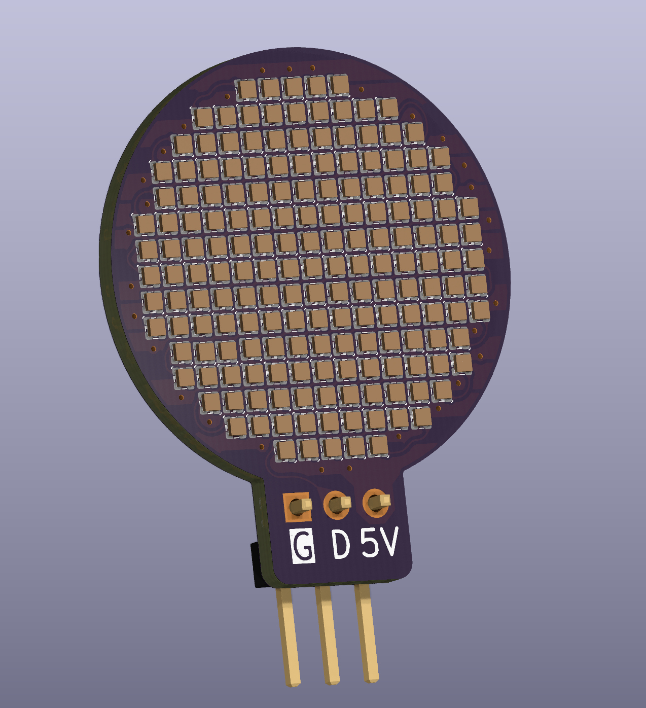

# Small RGB LED Pendant

Small RGB LED Pendant using 177 WS2812B-Style Addressable LEDs (Specifically Xinglight XL-1010RGBC-WS2812B)

This branch preserves a prototype version of the Pendant, when the LED matrix was being prototyped. To see the final project, head to the [main branch](https://github.com/mjhaahr/RGB-LED-Pendant/).

