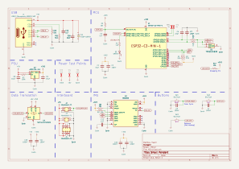
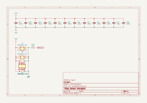

# Small RGB LED Pendant with User-Selectable Patterns

<!--   -->

Features:
- 177 Addressable RGB LEDs
    - WS2812B-style (NeoPixel) control
    - Xinglight XL-1010RGBC-WS2812B
- Two board design for tight packaging
    - Front board contains the LED Matrix
    - Back board holds the Microcontroller, IMU, and Power Regulation
- ESP32-C3 Module for control
    - Allows pattern changing over WiFi/Bluetooth as well as the buttons on the device
- Onboard IMU to generate reactive patterns
    - Utilizes a Bosch BNO055 for the simplicity of the orientation solution
- USB C Port for Power, Comms, and Programming
    - Connects to the ESP32-C3's onboard USB-CDC/JTAG device

## Table Of Contents
- [Bill Of Materials](#bill-of-materials)
- [Fabrication and Assembly](#fabrication-and-assembly)
- [Case Design](#case-design)
- [Code](#code)
- [Extra Notes](#extra-notes)

## Bill of Materials
- 1x Espressif ESP32-C3-MINI-1 - Microcontroller Module w/ WiFi and Bluetooth
    - [Datasheet](https://www.espressif.com/sites/default/files/documentation/esp32-c3-mini-1_datasheet_en.pdf)
    - [LCSC Part Number: C2934569](https://www.lcsc.com/product-detail/WiFi-Modules_Espressif-Systems-ESP32-C3-MINI-1-H4_C2934569.html)
    - Component: U1
- 1x Diodes Incorporated AP2112K-3.3 - Fixed 3V3 Regulator
    - [Datasheet](https://www.diodes.com/assets/Datasheets/AP2112.pdf)
    - [LCSC Part Number: C51118](https://www.lcsc.com/product-detail/Voltage-Regulators-Linear-Low-Drop-Out-LDO-Regulators_Diodes-Incorporated-AP2112K-3-3TRG1_C51118.html)
    - Component: U2
- 1x Bosch Sensortec BNO055 - Absolute Orientation Sensor - 9 Axis IMU and Sensor Fusion Processor
    - [Datasheet](https://www.bosch-sensortec.com/media/boschsensortec/downloads/datasheets/bst-bno055-ds000.pdf)
    - [LCSC Part Number: C93216](https://www.lcsc.com/product-detail/Accelerometers_Bosch-Sensortec-BNO055_C93216.html)
    - Component: U3
- 1x TI SN74LVC1T45DCK - Logic Level Translator
    - [Datasheet](https://www.ti.com/lit/ds/symlink/sn74lvc1t45.pdf)
    - [LCSC Part Number: C9382](https://www.lcsc.com/product-detail/Translators-Level-Shifters_Texas-Instruments-SN74LVC1T45DCKR_C9382.html)
    - Component: U4
- 1x Tech Public TPD2EUSB30 - 2-Channel USB ESD/TVS Diode (Clone of TI part with the same name)
    - [Datasheet](https://www.ti.com/lit/ds/symlink/tpd2eusb30.pdf)
    - [LCSC Part Number: C5182099](https://www.lcsc.com/product-detail/ESD-and-Surge-Protection-TVS-ESD_TECH-PUBLIC-TPD2EUSB30DRTR_C5182099.html)
    - Component: D1
- 1x TI ESD441 - 1-Channel VBUS ESD Diode
    - [Datasheet](https://www.ti.com/lit/ds/symlink/esd441.pdf)
    - [LCSC Part Number: C22427765](https://www.lcsc.com/product-detail/ESD-and-Surge-Protection-TVS-ESD_Texas-Instruments-ESD441DPLR_C22427765.html)
    - Component: D2
- 1x XINGLIGHT XL-1608SYGC-04 - Green LED
    - [Datasheet](https://www.lcsc.com/datasheet/lcsc_datasheet_2410121310_XINGLIGHT-XL-1608SYGC-04_C965806.pdf)
    - [LCSC Part Number: C965806](https://www.lcsc.com/product-detail/LED-Indication-Discrete_XINGLIGHT-XL-1608SYGC-04_C965806.html)
    - Component: D3
- 177x Xinglight XL-1010RGBC-WS2812B - 1mm x 1mm Addressable RGB LED
    - [Datasheet](https://www.lcsc.com/datasheet/lcsc_datasheet_2410121315_XINGLIGHT-XL-1010RGBC-WS2812B_C5349953.pdf)
    - [LCSC Part Number: C5349953](https://www.lcsc.com/product-detail/RGB-LEDs-Built-in-IC_XINGLIGHT-XL-1010RGBC-WS2812B_C5349953.html)
    - Component: D4-D180
- 3x Bossie BX-TS-26-342TP - SMD Tactile Push Buttons:
    - [Datasheet](https://www.lcsc.com/datasheet/lcsc_datasheet_2410121625_Bossie-BX-TS-26-342TP_C18078117.pdf)
    - [LCSC Part Number: C18078117](https://www.lcsc.com/product-detail/Tactile-Switches_Bossie-BX-TS-26-342TP_C18078117.html)
    - Component: SW1-SW3
- 1x G-Switch GT-USB-9010AB - USB 2.0 USB-C Connector (GCT-USB4105-GF Clone)
    - [Datasheet](https://www.lcsc.com/datasheet/lcsc_datasheet_2411221125_G-Switch-GT-USB-9010AB_C2988366.pdf)
    - [LCSC Part Number: C2988366](https://www.lcsc.com/product-detail/USB-Connectors_G-Switch-GT-USB-9010AB_C2988366.html)
    - Component: J1
- Headers (Used as Interboard Connectors)
    - 2x 2x2 Pin Socket - 1.27mm Pitch - Vertical SMD
        - Component: J2, J3
        - [LCSC Part Number: C5160799](https://www.lcsc.com/product-detail/Female-Headers_DEALON-DW127S-22-04-43_C5160799.html)
    - 1x 2x4 Pin Socket - 1.27mm Pitch - Vertical SMD
        - Component: J4
        - [LCSC Part Number: C5160801](https://www.lcsc.com/product-detail/Female-Headers_DEALON-DW127S-22-08-43_C5160801.html)
    - 2x 2x2 Pin Header - 1.27mm Pitch - Vertical SMD
        - Component: J5, J6
        - [LCSC Part Number: C5160758](https://www.lcsc.com/product-detail/Pin-Headers_DEALON-DZ127S-22-04-55_C5160758.html)
    - 1x 2x4 Pin Header - 1.27mm Pitch - Vertical SMD
        - Component: J7
        - [LCSC Part Number: C5160760](https://www.lcsc.com/product-detail/Pin-Headers_DEALON-DZ127S-22-08-55_C5160760.html)
- Capacitors
    - *All Packages are 0402 unless otherwise noted*
    - 10µF
        - Component: C1, C8, C9, C16
        - [LCSC Part Number: C7472949](https://www.lcsc.com/product-detail/Multilayer-Ceramic-Capacitors-MLCC-SMD-SMT_Chinocera-HGC0402R5106M100NTEJ_C7472949.html)
    - 100nF
        - Component: C2, C4, C5, C10, C13, C14, C17-C28
        - [LCSC Part Number: C1525](https://www.lcsc.com/product-detail/Multilayer-Ceramic-Capacitors-MLCC-SMD-SMT_Samsung-Electro-Mechanics-CL05B104KO5NNNC_C1525.html)
    - 1µF
        - Component: C3, C12, C15
        - [LCSC Part Number: C14445](https://www.lcsc.com/product-detail/Multilayer-Ceramic-Capacitors-MLCC-SMD-SMT_Samsung-Electro-Mechanics-CL05A105KP5NNNC_C14445.html)
    - 22pF
        - Component: C6, C7
        - [LCSC Part Number: C106203](https://www.lcsc.com/product-detail/Multilayer-Ceramic-Capacitors-MLCC-SMD-SMT_YAGEO-CC0402JRNPO9BN220_C106203.html)
    - 120nF
        - Component: C11
        - [LCSC Part Number: C7393864](https://www.lcsc.com/product-detail/Multilayer-Ceramic-Capacitors-MLCC-SMD-SMT_CCTC-TCC0402X7R124K160AT_C7393864.html)
- Resistors:
    - *All Packages are 0402 unless otherwise noted*
    - 3.3kΩ
        - Component: R1, R2
        - [LCSC Part Number: C25890](https://www.lcsc.com/product-detail/Chip-Resistor-Surface-Mount_UNI-ROYAL-Uniroyal-Elec-0402WGF3301TCE_C25890.html)
    - 10kΩ
        - Component: R3, R8, R9, R12
        - [LCSC Part Number: C25744](https://www.lcsc.com/product-detail/Chip-Resistor-Surface-Mount_UNI-ROYAL-Uniroyal-Elec-0402WGF1002TCE_C25744.html)
    - 1.3kΩ
        - Component: R4
        - [LCSC Part Number: C25866](https://www.lcsc.com/product-detail/Chip-Resistor-Surface-Mount_UNI-ROYAL-Uniroyal-Elec-0402WGF1301TCE_C25866.html)
    - 0Ω
        - Component: R5, R6
        - [LCSC Part Number: C17168](https://www.lcsc.com/product-detail/Chip-Resistor-Surface-Mount_UNI-ROYAL-Uniroyal-Elec-0402WGF0000TCE_C17168.html)
    - 100kΩ
        - Component: R7
        - [LCSC Part Number: C25741](https://www.lcsc.com/product-detail/Chip-Resistor-Surface-Mount_UNI-ROYAL-Uniroyal-Elec-0402WGF1003TCE_C25741.html)
    - 5.1kΩ
        - Component: R10, R11
        - [LCSC Part Number: C25905](https://www.lcsc.com/product-detail/Chip-Resistor-Surface-Mount_UNI-ROYAL-Uniroyal-Elec-0402WGF5101TCE_C25905.html)
    - 470Ω
        - Component: R13
        - [LCSC Part Number: C25117](https://www.lcsc.com/product-detail/Chip-Resistor-Surface-Mount_UNI-ROYAL-Uniroyal-Elec-0402WGF4700TCE_C25117.html)

## Fabrication and Assembly
- The boards were fabricated and assembled by JLCPCB
- The boards were combined into one frame to reduce the cost of having to make and assemble two designs in one order
- The frame was enlarged to fit the minimum board size for JLCPCB's PCBA service as well as provides the necessary fiducials and edge rails for assembly

## Case Design
*TODO: Current not even started*

## Code
*TODO: Not written*
- To load the custom board definitions do the following:
    - Lol, I don't know yet
    
## Extra Notes
- The [Only Pendant](https://github.com/mjhaahr/RGB-LED-Pendant/tree/Only_Pendant) branch features a much-simplified design, with only the LED Matrix and no control board, it functions the same as a normal NeoPixel matrix.
- A future version may replace the BNO055 with a more up-to-date IMU (and one that is NRND) and move the orientation calculation onto the main MCU
- A future design may include an onboard battery and charger (would likely require enlarging the board)
- V1 Hardware was Fabricated at JLCPCB, during standup it was found that a strapping pin was forgotten (GPIO8), for the V1 hardware a 8.06kΩ 0603 pull-up resistor was added across pins 4 and 6 of U4, this was fixed in the next revision with a 10kΩ closer to the MCU Module (U1)
